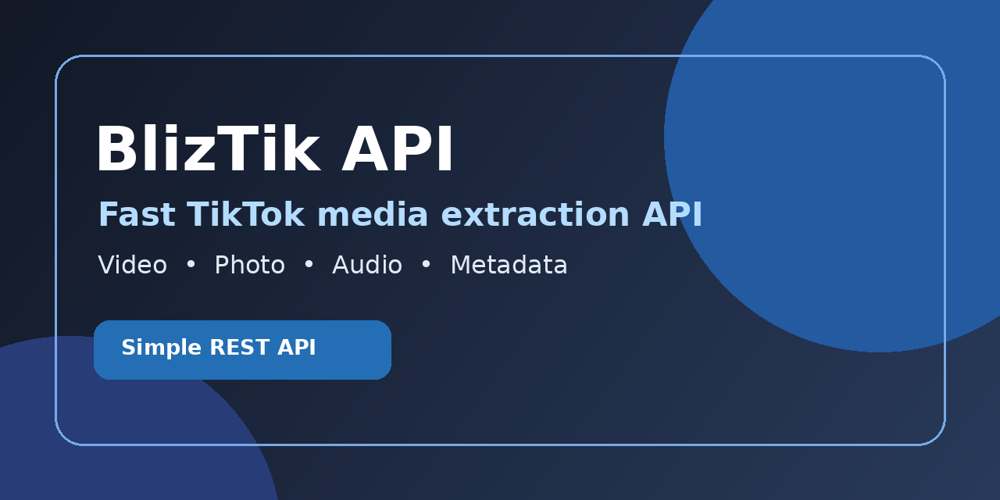
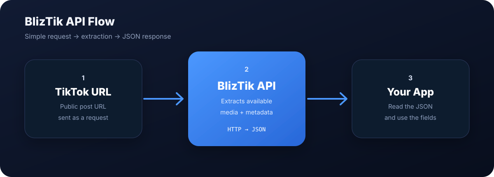

# 🚀 BlizTik API

> Simple REST API for getting TikTok media and metadata from public links.



BlizTik API is made for projects that need to turn a public TikTok URL into useful media data without building the whole extraction flow from scratch.

It can return videos, photos, slideshows, audio, and basic post metadata in JSON, so you can plug it into a website, bot, mobile app, or another backend.

## ✨ What it can do

- 🎬 Get TikTok videos with no-watermark media
- 📸 Support photo and slideshow posts
- 🎵 Get audio and music from TikTok posts
- 👤 Get author and post metadata
- 🌐 Support browser-based requests with CORS
- ⚡ Simple REST API with no SDK required
- 🧩 Easy to integrate with websites, apps, bots, and backends

## 🔄 How it works

The basic flow is straightforward: send a public TikTok URL to the API, let the server process it, then use the JSON response in your project.



## 🧪 Try the API

There is a small test page if you just want to see whether the API is responding correctly.

**https://bliztik-api.vercel.app/**

Paste a public TikTok URL, press **GET**, and you can see the HTTP status, response time, and returned JSON.

## 🚀 Quick start

### Endpoint

```text
https://api.bliztik.web.id/apitiktok?url=YOUR_TIKTOK_URL
```

Replace `YOUR_TIKTOK_URL` with the public TikTok URL you want to process. Remember to URL-encode it when building the request yourself.

### JavaScript

```js
const response = await fetch(
  "https://api.bliztik.web.id/apitiktok?url=" +
  encodeURIComponent(tiktokUrl)
);

const data = await response.json();

console.log(data);
```

### cURL

```bash
curl "https://api.bliztik.web.id/apitiktok?url=YOUR_TIKTOK_URL"
```

## 📦 Response

The API responds with JSON. Depending on the TikTok post, the response can contain media URLs and metadata such as:

```text
video
no_watermark_url
audio_url
images
author
title
quality
width
height
```

The exact fields are not guaranteed to be identical for every post type. A video, slideshow, and photo post naturally have different data, because apparently even social-media URLs needed several species.

## 🧩 Integration

BlizTik API works with any application that can make HTTP requests, including:

- Websites
- Node.js applications
- Mobile applications
- Bots
- Backend services
- Other REST API clients

The API can be used with:

- Websites
- Node.js applications
- Mobile applications
- Bots
- Backend services
- Other REST API clients

## 🛡️ Usage notes

BlizTik API is intended for publicly accessible TikTok content.

Private, deleted, restricted, or otherwise unavailable posts may return an error or incomplete data. Avoid sending excessive traffic or using the service in a way that puts unnecessary load on the API.

Make sure your own project also follows the rules and policies that apply to the content and platform you're working with.

## 🌐 Links

- **Live API:** https://api.bliztik.web.id
- **API Test:** https://bliztik-api.vercel.app/
- **Website:** https://bliztik.web.id
- **GitHub:** https://github.com/BlizPS/bliztik-api

## 📌 About

BlizTik API is an open-source project built to keep TikTok media integration relatively simple: make a request, receive JSON, and handle the result in your own application.

The project is intentionally straightforward so it can be used as a small API service or as a starting point for a larger integration.
