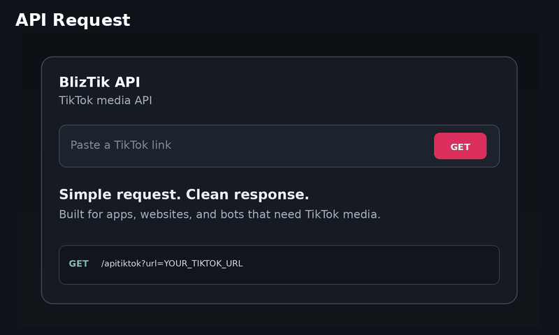

# 🚀 BlizTik API

> Fast and simple TikTok media extraction API for developers.


BlizTik API accepts a public TikTok URL and returns available media and metadata as JSON.

### ✨ Supports

- 🎬 Video & no-watermark video when available
- 📸 Photo & slideshow
- 🎵 Audio / music when available
- 👤 Author and media metadata
- 🌐 CORS support
- ⚡ Simple HTTP requests

## 🎞️ See it in action



## 🚀 Quick Start

**Endpoint**

```text
https://api.bliztik.web.id/apitiktok?url=YOUR_TIKTOK_URL
```

**JavaScript**

```js
const response = await fetch(
  "https://api.bliztik.web.id/apitiktok?url=" +
  encodeURIComponent(tiktokUrl)
);

const data = await response.json();
console.log(data);
```

**cURL**

```bash
curl "https://api.bliztik.web.id/apitiktok?url=YOUR_TIKTOK_URL"
```

## 📦 Response

The API returns JSON with the media available for the supplied TikTok post.

Typical data can include:

```text
video
no_watermark_url
audio_url
images
author
title
quality
width
height
```

The exact fields depend on the source post and upstream result.

## 🔄 How it works

```text
TikTok URL
    ↓
BlizTik API
    ↓
Media processing
    ↓
JSON response
    ↓
Your application
```

Works with any application that can make an HTTP request, including websites, Node.js apps, mobile apps, bots, and backend services.

## ⚠️ Notes

Results depend on the public TikTok URL and the media available at request time. Private, removed, restricted, or unavailable posts may return an error or incomplete data.

Please keep requests reasonable and avoid abusive or excessive traffic.

## 🌐 Links

- **Live API:** https://api.bliztik.web.id
- **Website:** https://bliztik.web.id
- **GitHub:** https://github.com/BlizPS/bliztik-api

## 📄 License

MIT License. See [`LICENSE`](LICENSE).
