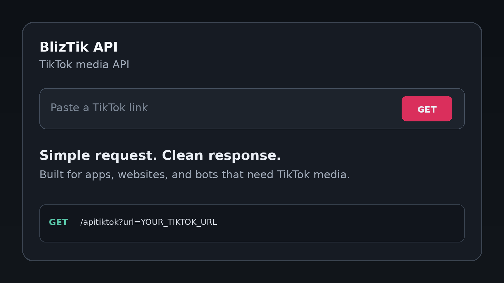
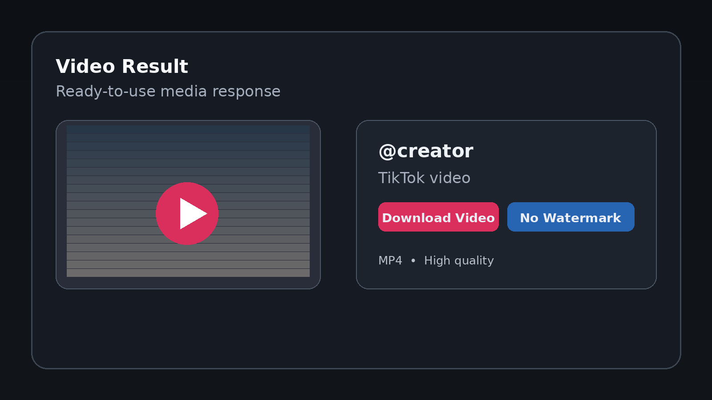
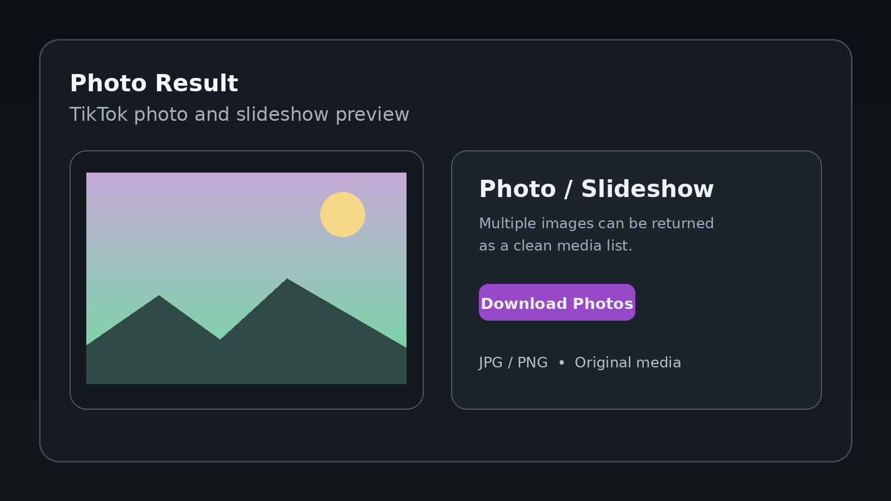
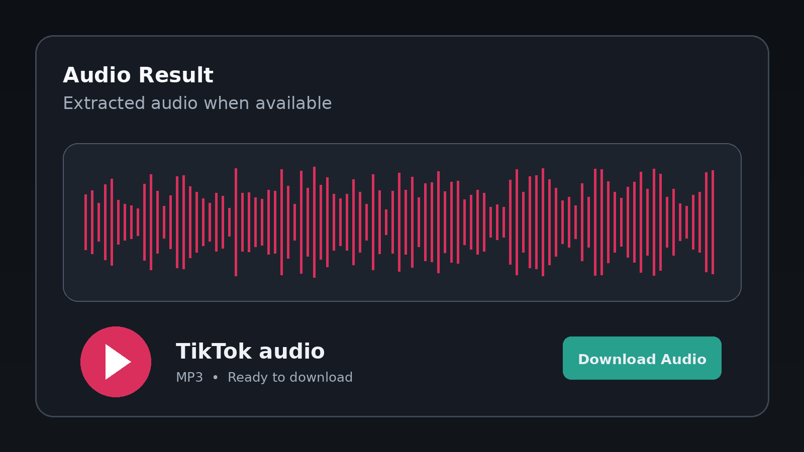

# BlizTik API

> Simple HTTP API to get TikTok video, photo, audio, and metadata.

BlizTik API lets you send a TikTok URL and receive the available media information as JSON.

**No API key is required.**

> ⚠️ BlizTik is an unofficial third-party project and is not affiliated with TikTok.

---

## 🚀 Quick Start

You only need one request:

```text
GET https://api.bliztik.web.id/apitiktok?url=YOUR_TIKTOK_URL
```

### Example

```text
https://api.bliztik.web.id/apitiktok?url=https%3A%2F%2Fwww.tiktok.com%2F%40username%2Fvideo%2F123456789
```

The API returns JSON containing the detected post type and available media.

---

## 🌐 Try BlizTik

Website:

```text
https://bliztik.web.id
```

API:

```text
https://api.bliztik.web.id/apitiktok
```

---

# 📌 What Can It Get?

| Content | Result |
| --- | --- |
| 🎬 TikTok video | ✅ |
| 🚫 No-watermark video | ✅ Available |
| ▶️ Video preview | ✅ |
| 🎵 Audio / music | ✅ Available |
| 📸 Photos | ✅ |
| 🖼️ Slideshows | ✅ |
| 👤 Author information | ✅ Available |
| 🖼️ Cover | ✅ Available |
| 📊 Video metadata | ✅ Available |

---

# 📥 How to Use the API

## JavaScript

```js
const tiktokUrl =
  "https://www.tiktok.com/@username/video/123456789";

const apiUrl =
  "https://api.bliztik.web.id/apitiktok?url=" +
  encodeURIComponent(tiktokUrl);

const response = await fetch(apiUrl);
const result = await response.json();

console.log(result);
```

---

## cURL

```bash
curl "https://api.bliztik.web.id/apitiktok?url=YOUR_TIKTOK_URL"
```

---

## Node.js

```js
async function parseTikTok(tiktokUrl) {
  const api =
    "https://api.bliztik.web.id/apitiktok?url=" +
    encodeURIComponent(tiktokUrl);

  const response = await fetch(api);

  if (!response.ok) {
    throw new Error(`HTTP ${response.status}`);
  }

  return await response.json();
}

const result = await parseTikTok(
  "https://www.tiktok.com/@username/video/123456789"
);

console.log(result);
```

---

# 📦 API Response

A successful request looks like this:

```json
{
  "code": 200,
  "msg": "Parse successful - Bliz",
  "data": {
    "platform": "TikTok",
    "type": "video",
    "title": "Example TikTok video",
    "desc": "Example description",
    "author": {
      "name": "username",
      "id": "",
      "avatar": "https://..."
    },
    "cover": "https://...",
    "preview_url": "https://api.bliztik.web.id/api/proxy?...",
    "no_watermark_url": "https://api.bliztik.web.id/api/proxy?...",
    "audio_url": "https://api.bliztik.web.id/api/proxy?...",
    "link": "https://www.tiktok.com/@username/video/123456789",
    "quality": "1080p",
    "duration": 22,
    "width": 1080,
    "height": 1920,
    "images": [],
    "music": {
      "title": "Music title",
      "author": "Artist",
      "url": "https://...",
      "cover": "https://..."
    }
  }
}
```

---

# 🔎 Important Fields

## `type`

Tells you what kind of TikTok post was detected.

```text
video
photo
```

Example:

```js
if (result.data.type === "video") {
  // Video post
}

if (result.data.type === "photo") {
  // Photo / slideshow post
}
```

---

## `preview_url`

Use this when you want to **preview or play the video**.

```js
console.log(result.data.preview_url);
```

---

## `no_watermark_url`

Use this when you want the **no-watermark video**.

```js
console.log(result.data.no_watermark_url);
```

The field is available for supported video posts.

---

## `audio_url`

Use this when you want the **audio/music**.

```js
console.log(result.data.audio_url);
```

Audio is available when the post provides music/media data.

---

## `images`

For TikTok photo/slideshow posts, use:

```js
console.log(result.data.images);
```

Example:

```json
"images": [
  "https://...",
  "https://...",
  "https://..."
]
```

The images are returned in their detected order.

---

# 🎬 Video Example

For a video:

```js
const data = result.data;

console.log("Title:", data.title);
console.log("Author:", data.author.name);
console.log("Preview:", data.preview_url);
console.log("Video:", data.no_watermark_url);
console.log("Audio:", data.audio_url);
```

You can use `preview_url` as the video source:

```html
<video
  controls
  playsinline
  src="YOUR_PREVIEW_URL">
</video>
```

---

# 📸 Photo Example

For a photo/slideshow:

```js
const data = result.data;

if (data.type === "photo") {
  for (const image of data.images) {
    console.log(image);
  }
}
```

Simple HTML example:

```js
for (const image of data.images) {
  const img = document.createElement("img");

  img.src = image;
  img.loading = "lazy";

  document.body.appendChild(img);
}
```

---

# 🎵 Audio Example

```js
const audio = result.data.audio_url;

if (audio) {
  console.log("Audio:", audio);
}
```

Or use it in HTML:

```html
<audio controls src="YOUR_AUDIO_URL"></audio>
```

---

# 👤 Author Information

The API returns:

```json
"author": {
  "name": "username",
  "id": "",
  "avatar": "https://..."
}
```

Available fields:

| Field | Meaning |
| --- | --- |
| `name` | TikTok username |
| `id` | Author ID |
| `avatar` | Profile picture URL |

---

# 📊 Video Information

For video posts, the API returns:

| Field | Meaning |
| --- | --- |
| `quality` | Detected quality |
| `duration` | Duration in seconds |
| `width` | Video width |
| `height` | Video height |

Example:

```json
{
  "quality": "1080p",
  "duration": 22,
  "width": 1080,
  "height": 1920
}
```

Some metadata can be unavailable based on the TikTok post.

---

# 🎵 Music Information

Music information:

```json
"music": {
  "title": "Music title",
  "author": "Artist",
  "url": "https://...",
  "cover": "https://..."
}
```

You can access it with:

```js
console.log(result.data.music.title);
console.log(result.data.music.author);
console.log(result.data.music.url);
```

---

# ❌ Error Response

If the API cannot process the URL, check the `code` and `msg`.

Example:

```json
{
  "code": 400,
  "msg": "Invalid TikTok URL"
}
```

Temporary media extraction problems may return:

```json
{
  "code": 502,
  "msg": "TikTok media could not be parsed right now"
}
```

Always check the response before using the media fields.

---

# ⚠️ Why Can a TikTok Fail?

TikTok posts are extracted when the content is accessible.

Extraction can fail because of:

- Private post
- Deleted post
- Region restriction
- Age/account restriction
- TikTok changes
- TikTok anti-bot protection
- Temporary CDN errors
- Temporary rate limiting
- Media unavailable at the time of the request

A URL that works today may fail later if TikTok changes how the content is delivered.

---

# 🧩 Simple Integration Flow

```text
Your App
   │
   │ TikTok URL
   ▼
BlizTik API
   │
   │ JSON
   ▼
Your App
   │
   ├── Video → preview_url
   ├── Video → no_watermark_url
   ├── Audio → audio_url
   └── Photo → images[]
```

That's it. You don't need to build the TikTok extraction logic yourself.

---

# 🛠️ Useful for

BlizTik API can be integrated into:

- 🌐 Websites
- 📱 Android apps
- 🟢 Node.js applications
- 🐍 Python applications
- 🤖 Discord bots
- 💬 WhatsApp bots
- ⚙️ Automation tools
- 🔧 Backend services
- 📦 Downloader applications

---

# 📁 Repository Structure

```text
BlizTik-API/
├── assets/
│   ├── blizTikApi-request.png
│   ├── blizTikApi-video.png
│   ├── blizTikApi-photo.png
│   └── blizTikApi-audio.png
├── README.md
└── ...
```

---

# 🖼️ Preview

### API Request



### Video



### Photo



### Audio



---

# 🌐 CORS

BlizTik API supports cross-origin requests, so it can be called from browser-based applications as well as backend applications.

---

# 🚦 Rate Limits

Basic request protection and rate limiting may be applied.

Please avoid sending excessive requests.

For applications that repeatedly request the same TikTok URL, consider caching the result instead of repeatedly calling the API.

---

# 💡 Tips

### Always encode the TikTok URL

Use:

```js
encodeURIComponent(tiktokUrl)
```

instead of putting the raw URL directly into the query string.

### Check the post type

```js
if (data.type === "video") {
  // Handle video
}

if (data.type === "photo") {
  // Handle photos
}
```

### Check whether media exists

```js
if (data.no_watermark_url) {
  // Video is available
}

if (data.audio_url) {
  // Audio is available
}

if (data.images?.length) {
  // Photos are available
}
```

---

# 📜 Disclaimer

BlizTik is an unofficial third-party project and is not affiliated with, sponsored by, or endorsed by TikTok.

Use the API responsibly and make sure your application complies with applicable laws, platform rules, and the rights associated with the content you access.

---

## ⭐ Support the Project

If BlizTik is useful to you, you can:

- ⭐ Star the repository
- 🍴 Fork the project
- 🐛 Report bugs
- 💡 Suggest improvements
- 📢 Share the project with other developers

Thanks for using BlizTik API!
